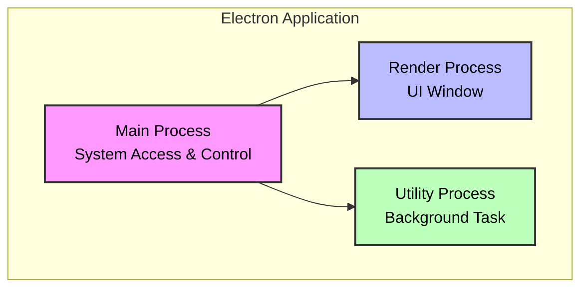
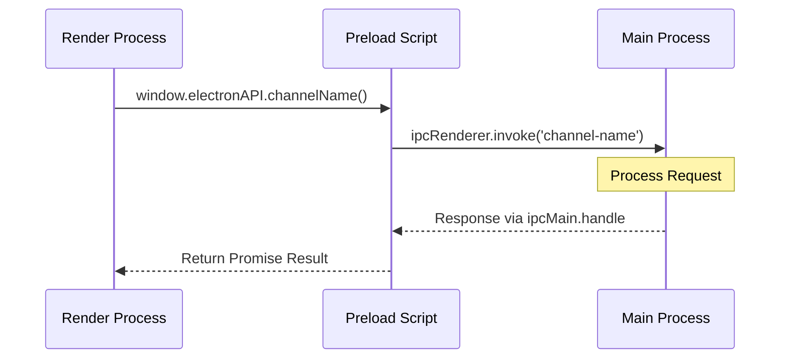
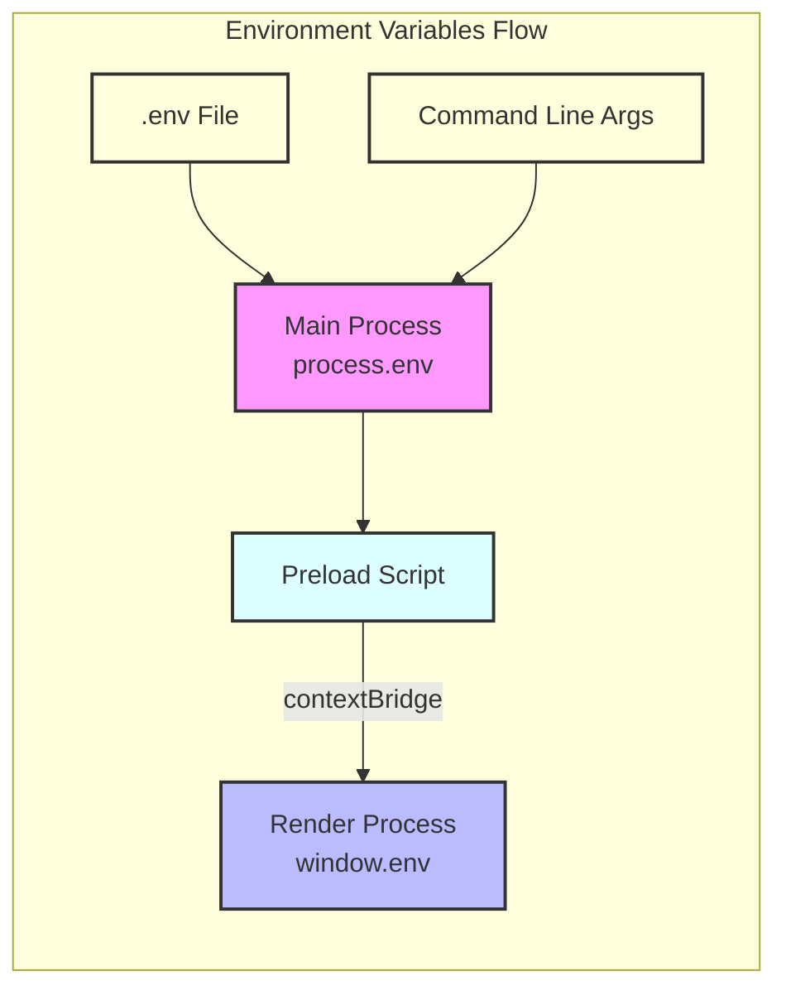

# Electron 101

<details>
<summary><strong>🧭 Table of Contents</strong></summary>

- [Built With Electron](#built-with-electron)
- [What is Electron](#what-is-electron)
- [Cross-Platform Multi-Process Architecture](#cross-platform-multi-process-architecture)
- [Electron Processes](#electron-processes)
  - [`MAIN PROCESS` _(The Application "Conductor")](#main-process-the-application-conductor)_
  - [`RENDER PROCESS(es)` _(The User Interface)](#render-processes-the-user-interface)_
  - [`UTILITY PROCESS(es)`](#utility-processes)
- [Inter Process Communication (IPC)](#inter-process-communication-ipc)
  - [Messaging Patterns](#messaging-patterns)
- [Environment Variables](#environment-variables)
- [Code Example](#code-example)
- [Glossary](#glossary)

</details>

## [Built With Electron](https://www.electronjs.org/apps)

> All these companies turning to Electron for their cross-platform applications is a huge vote of confidence!

|                       |                 |           |
| :-:                   | :-:             | :-:       | 
| VSCode                | Notion          | Loom      | 
| Trello                | Figma           | Asana     | 
| 1Password             | Microsoft Teams | Obsidian  | 
| Slack                 | Twitch          | Postman   | 

_**AND MANY MORE ...**_

# What is Electron

Ever wondered how apps like Visual Studio Code or Slack work seamlessly across Windows, macOS, and Linux? Well then, let me introduce you to Electron!

> [!NOTE]
>
> Electron is a powerful framework that lets developers build cross-platform desktop applications using familiar web technologies like HTML, CSS, and JavaScript.

At its core, Electron embeds Chromium (for rendering user interfaces) and Node.js (for backend logic) into a single application. With two distinct processes Electron relies on `Inter-Process Communication (IPC)` channels to manage interactions between the `MAIN PROCESS / UTILITY PROCESS(es)` (handling system-level tasks) and the `RENDER PROCESS(es)` (displaying the UI).

Electron's direct embedding of Chromium and Node.js, while a powerful contributor to its core strengths, also introduces challenges. Below is a quick overview of its pros and cons.

| pros                                                                                | cons  | 
| ---                                                                                 | ---   | 
| ✅ Cross-platform support (Windows, macOS, Linux)                                   | 👎 Larger application file sizes** | 
| ✅ Uses familiar web technologies (HTML, CSS, JavaScript)                           | 👎 Higher memory and CPU usage compared to native apps** |
| ✅ Active community and extensive documentation                                     | 👎 Slower startup times due to overhead** |
| ✅ Native API integrations and access to the entire Node.js ecosystem               | 👎 Steep learning curve for secure IPC and performance optimization |
| ✅ Faster cross-platform development time (monorepo 👉 multiple production assets)  | 👎 Performance limitations for graphics-heavy or data-intensive apps |

_\*\* directly attributable to the embedding of Chromium & Node.js_

# Cross-Platform Multi-Process Architecture

Electron's ability to run desktop applications across Windows, macOS, and Linux comes from its inheritance of <a href="https://www.chromium.org/developers/design-documents/multi-process-architecture/" target="_blank" rel="noopener noreferrer">Chromium's "multi-process" architecture</a>. This model splits an application into:


- One or more `RENDER PROCESS(es)`
- A single `MAIN PROCESS`
  - _Optional_ `UTILITY PROCESS(es)` spawn off of the `MAIN PROCESS` and run in isolated Node.js environment

Think of this setup like a web browser, where each tab or extension runs in its own process - explaining why Chrome can gobble up so much RAM!



> [!IMPORTANT]
> 
> In Electron, each process operates in its **own isolated environment** with **specific roles and access levels to system resources**.  
>      
> While this adds some complexity, it improves security (by isolating risky tasks), stability (by preventing crashes from spreading), and error handling (by allowing processes to fail independently without always crashing the `MAIN PROCESS`).

# Electron Processes

| Process Type  | Key Responsibilities                                                                                | Node.js Access?                                                          | UI Rendering Role | Default Security Context          | Typical Use Cases / Entry Point File                            | 
| ---           | ---                                                                                                 | :-:                                                                     | :-:               | :-:                               | ---                                                             |
| RENDER        | - Rendering HTML / CSS / JS <br /> - Handling UI Logic                                              | NONE <br /> _(limited access via `PRELOAD` script in sandboxed mode)_   | PRIMARY ROLE      | LIMITED _(sandboxed by default)_  | - UI for each window or web content                             | 
| MAIN          | - Managing app lifecycle <br /> - Window management <br /> - Interacting with native OS APIs        | FULL                                                                    | NONE              | FULL SYSTEM ACCESS                | - Application Entry Point <br /> - System-level interactions    | 
| UTILITY**     | - Offloading specific tasks (e.g., CPU-intensive or crash-prone operations)                         | FULL                                                                    | NONE              | FULL SYSTEM ACCESS                | - Specialized background tasks _(communicates with RENDER PROCESS(es) via MessagePort)_ |         

## `MAIN PROCESS` _(The "Conductor")_

> [!IMPORTANT]
>
> Every Electron application has **exactly** 1 `MAIN PROCESS`

The `MAIN PROCESS` is the core of every Electron application, acting like a conductor directing the app's essential functions. It runs in an isolated Node.js environment with full access to the Node.js API.

**Primary Responsibilities**

1. Window Management  
Through the `BrowserWindow` module supplied by Electron the `MAIN PROCESS` creates and controls every visual window in the application such as the main interface or pop-up dialogs.

2. Application Lifecycle Control  
The `app` module lets the `MAIN PROCESS` handle key events like launching / quitting the application, or responding when the application is reopened. 

3. Native OS Integration  
The `MAIN PROCESS` manages system-level interactions such as creating application menus, displaying system dialogs, managing tray icons or responding to OS notifications.

## `RENDER PROCESS(es)` _(The "Painter")_

> [!TIP]
> 
> Each `BrowserWindow` of an Electron application can be thought of as its own self contained `RENDER PROCESS` acting like an independent web page.
 
The `RENDER PROCESS(es)` power the visual elements of an Electron app, such as buttons, text, and images, much like a web page in a browser. Since Electron 20 (released in 2022), `RENDER PROCESS(es)` are sandboxed by default, meaning they have limited access to system resources and no direct access to Node.js APIs for enhanced security. Instead, they rely on communication with the `MAIN PROCESS` via `Inter-Process Communication (IPC)` channels for certain tasks.

**Primary Responsibilities**

1. UI Rendering  
The `RENDER PROCESS(es)` handles everything you see in a window, including displaying HTML, applying CSS styles, running JavaScript, and responding to user interactions like clicks or keystrokes.

2. Communication with `MAIN PROCESS` via IPC  
For tasks requiring system access (e.g., saving files, database interactions, or accessing hardware), the `RENDER PROCESS(es)` sends requests to the `MAIN PROCESS` using `Inter-Process Communication (IPC)` channels.

## `UTILITY PROCESS(es)` _(The "Mercenary")_

`UTILITY PROCESS(es)` are like hired specialists in an Electron app, designed to handle specific tasks that the `MAIN PROCESS` or `RENDER PROCESS(es)` shouldn't tackle. Spawned by the `MAIN PROCESS` using Electron's `UtilityProcess API`, they run in a dedicated Node.js environment with full Node.js and system access, similar to the `MAIN PROCESS`. These processes are ideal for tasks that need extra isolation or resources without slowing down the app or risking its stability.

**Key Use Cases**  
- Isolating untrusted code: Runs third-party or risky code in a secure, separate environment to protect the app.
- Handling heavy calculations: Performs CPU-intensive tasks, like data processing, to avoid slowing the `MAIN PROCESS` or freezing the `RENDER PROCESS(es)`'s UI.
- Stabilizing risky components: Isolates unstable modules that might crash, ensuring the core app remains reliable.

# Inter Process Communication (IPC)

> [!NOTE]
>
> `Inter Process Communication (IPC)` enables Electron's isolated processes (`MAIN / UTILITY` and `RENDER`) to exchange data or trigger actions securely

While there are older patterns for `Inter Process Communication (IPC)`, the recommended approach for request-response communication is to use asynchronous calls with `ipcRenderer.invoke` in the `RENDER PROCESS(es)` (via a `PRELOAD SCRIPT`) and `ipcMain.handle` in the `MAIN PROCESS`. This keeps your application responsive by not blocking the UI while waiting for a task to complete.



Let's walk through how IPC channels are registered and ingested in an Electron application:

## Channel Registration

IPC channels are registered in two places:

1. **Main Process** (`electron/main/index.ts` or similar)
   - Registers handlers for incoming IPC messages using `ipcMain.handle`
   - Each handler is associated with a unique channel name (e.g., 'db/user/getInfoById')
   - Handlers are typically registered during app initialization:
   ```typescript
   // In electron/main/index.ts
   app.whenReady().then(() => {
     ipcMain.handle('channel-name', async (event, ...args) => {
       // Handle the request
       return result;
     });
   });
   ```

2. **Preload Script** (`electron/preload/index.ts`)
   - Exposes a secure API to the `RENDER PROCESS(es)` using `contextBridge`
   - Maps channel names to `ipcRenderer.invoke` calls
   - Creates a type-safe interface for the Renderer to use:
   ```typescript
   // In electron/preload/index.ts
   contextBridge.exposeInMainWorld('electronAPI', {
     channelName: (...args) => ipcRenderer.invoke('channel-name', ...args)
   });
   ```

## Channel Ingestion

The `RENDER PROCESS(es)` consumes these channels through the exposed API:

1. **Type Definitions** (typically in `src/types/electron.d.ts`)
   ```typescript
   interface ElectronAPI {
     channelName: (...args: any[]) => Promise<any>;
   }
   
   declare global {
     interface Window {
       electronAPI: ElectronAPI;
     }
   }
   ```

2. **Usage in Components** (`src/components/*.tsx` or similar)
   ```typescript
   // Access via window.electronAPI
   const result = await window.electronAPI.channelName(...args);
   ```

# Environment Variables

> [!NOTE]
>
> Due to Electron's multi-process architecture, environment variables must be independently configured for the `MAIN PROCESS` and `RENDER PROCESS(es)`.

Environment variables can be set in a .env file or via command-line arguments (e.g., `ELECTRON_ENABLE_LOGGING=true npm start`). In production, the [electron-builder.yml](https://github.com/Learn-Like-Me-LLM/ELECTRON-EXAMPLE/blob/main/electron-builder.yml) is excluded from the ASAR package but included as an extraResource to allow runtime access to configuration settings without embedding them in the immutable ASAR archive.



## Key Electron Variables

Electron's environment variables fall into three categories:

| Category                | Purpose                                           | Example Variables |
| ---                     | ---                                               | --- |
| Development Variables   | Aid in debugging and development workflows        | `ELECTRON_ENABLE_LOGGING`, `ELECTRON_DEBUG_NOTIFICATIONS` |
| Production Variables    | Control runtime behavior in packaged applications | `NODE_OPTIONS`, `ELECTRON_TRASH` |
| System Variables        | Set by Electron itself to provide context         | `ORIGINAL_XDG_CURRENT_DESKTOP` |

**Development Variables**
- `ELECTRON_ENABLE_LOGGING`: Outputs Chromium's internal logs to the console, helpful for debugging renderer issues
- `ELECTRON_LOG_FILE`: Specifies a file destination for Chromium's internal logs
- `ELECTRON_DEBUG_DRAG_REGIONS`: Adds color highlighting to draggable regions on macOS for visual debugging
- `ELECTRON_DEBUG_NOTIFICATIONS`: Adds detailed logging for notification lifecycles on macOS

**Production Variables**
- `NODE_OPTIONS`: Controls Node.js behavior (e.g., --max-old-space-size=2048 for memory limits)
- `ELECTRON_NO_ASAR`: Disables ASAR archive support in child processes
- `ELECTRON_RUN_AS_NODE`: Starts the process as a standard Node.js process instead of Electron
- `ELECTRON_TRASH`: Sets the trash implementation on Linux (options: gio, gvfs-trash, trash-cli, etc.)
- `ELECTRON_OZONE_PLATFORM_HINT`: Controls the preferred display backend on Linux (options: auto, wayland, x11)

## `MAIN PROCESS` / `UTILITY PROCESS(es)`

In the `MAIN PROCESS`, environment variables are accessed via process.env, as in any Node.js application. The [electron/main/index.ts](https://github.com/Learn-Like-Me-LLM/ELECTRON-EXAMPLE/blob/main/electron/main/index.ts) file in the example application uses the dotenv package to load variables from a .env file:javascript

```javascript
import dotenv from 'dotenv';

// CONFIGURE: environment specific envPath
const envPath = app.isPackaged ? '<PRODUCTION-env-path>' : '<DEVELOPMENT-env-path>'
dotenv.config({ path: envPath });

const var = process.env.___
```

## `RENDER PROCESS(es)`

> [!IMPORTANT]
> 
> Environment variables are not directly available in the `RENDER PROCESS(es)` due to its sandboxed nature. 

Instead, they are exposed securely via the [`PRELOAD SCRIPT`](https://github.com/Learn-Like-Me-LLM/ELECTRON-EXAMPLE/blob/main/electron/preload/index.ts) via contextBridge to append them to Electron's window module. In the  file, the example application exposes specific variables:javascript

```javascript
import { contextBridge } from 'electron';

contextBridge.exposeInMainWorld('env', {
  CUSTOM_ENV: process.env.CUSTOM_ENV,
  NODE_ENV: process.env.NODE_ENV,
});
```

This makes CUSTOM_ENV and NODE_ENV accessible in the Renderer Process as window.env.CUSTOM_ENV and window.env.NODE_ENV. In the Renderer Process (e.g., React components in the src/ directory), these variables can control UI behavior:javascript

```javascript
// Example React component using exposed environment variables
import React from 'react';

function App() {
  const isDev = window.env.NODE_ENV === 'development';
  
  return (
    <div>
      <p>Is Dev: {isDev}</p>
      <p>Custom setting: {window.env.CUSTOM_ENV}</p>
    </div>
  );
}
```

# Code Example

> [Example Electron repo](https://github.com/Learn-Like-Me-LLM/ELECTRON-EXAMPLE)

# Glossary

| Word                                  | Description                                                                                                                                                                                                                                                           |
| :------------------------------------ | :-------------------------------------------------------------------------------------------------------------------------------------------------------------------------------------------------------------------------------------------------------------------- |
| Electron                              | A framework for building cross-platform desktop applications for Windows, macOS, and Linux using web technologies (HTML, CSS, and JavaScript). It embeds Chromium for rendering the user interface and Node.js for backend logic and system access.                       |
| Chromium                              | The open-source web browser project that provides the rendering engine (primarily for displaying HTML, CSS, and JavaScript) for Electron applications.                                                                                                                    |
| Node.js                               | A JavaScript runtime environment that allows Electron's main process (and utility processes) to execute JavaScript code with access to system-level functionalities, such as file system operations and network requests, outside of a typical browser sandbox.           |
| "Native" Application                  | An application developed using platform-specific programming languages and tools (e.g., Swift/Objective-C for macOS, C#/C++ for Windows) tailored for a particular operating system, often resulting in separate codebases for different platforms.                      |
| "Cross-Platform" Application          | An application designed to function on multiple operating systems (like Windows, macOS, and Linux) from a substantially shared codebase, which Electron facilitates by using web technologies.                                                                               |
| `MAIN PROCESS`                        | The single, primary process in every Electron application that serves as the application's entry point. It manages the application lifecycle, creates and manages `BrowserWindow` instances (application windows), interacts with native OS APIs, and has full Node.js API access. |
| `RENDER PROCESS(es)`                  | Processes responsible for rendering the web content (HTML, CSS, JavaScript) within a `BrowserWindow`. Each window typically runs its own renderer process, which is sandboxed by default for security and has limited direct access to Node.js APIs (access is usually facilitated via a `PRELOAD` Script). |
| `UTILITY PROCESS(es)`                 | Optional child processes spawned from the `MAIN PROCESS` using the `UtilityProcess API`. They run in a Node.js environment, allowing them to handle tasks like CPU-intensive operations, untrusted code execution, or modules prone to crashing, thereby isolating these tasks from the main or renderer processes. |
| `Inter-Process Communication (IPC)`   | The mechanism enabling Electron's isolated processes (Main, Renderer, and Utility) to exchange data and trigger actions. This communication typically occurs over named channels using modules like `ipcMain` and `ipcRenderer`.                                        |
| Sandboxed                             | A security feature in Electron where `RENDER PROCESS(es)` are run in an environment with restricted access to Node.js APIs and direct system resources. This helps protect against malicious code in web content. Communication with the `MAIN PROCESS` for privileged operations is done via IPC. |
| `BrowserWindow`                       | An Electron module available in the `MAIN PROCESS` that is used to create and control application windows. Each `BrowserWindow` instance loads web content in a separate `RENDER PROCESS`.                                                                               |
| `PRELOAD` Script                      | A script specified when creating a `BrowserWindow` that runs in the `RENDER PROCESS` context before its web content (HTML, CSS, JS) begins loading. It has access to Node.js APIs (though `contextIsolation` is typically enabled) and is used to securely expose specific IPC functionalities or Node.js capabilities to the renderer via the `contextBridge` module. |
| Context Isolation                     | A default-enabled security feature in Electron ensuring that the `PRELOAD` script and the renderer's main world (the JavaScript environment of the loaded web page) run in separate JavaScript contexts. This prevents the web page from directly accessing privileged APIs exposed in the preload script, requiring the use of `contextBridge` for secure communication. |
| `ipcMain`                             | An Electron module used in the `MAIN PROCESS` to handle asynchronous and synchronous messages sent from `RENDER PROCESS(es)` (via `ipcRenderer`). It allows the main process to listen for messages on specific channels (e.g., using `ipcMain.handle` or `ipcMain.on`).     |
| `ipcRenderer`                         | An Electron module used typically within a `PRELOAD` script (and exposed to the `RENDER PROCESS` via `contextBridge`) to send synchronous and asynchronous messages to the `MAIN PROCESS` (e.g., using `ipcRenderer.invoke` or `ipcRenderer.send`) and to receive replies. |

